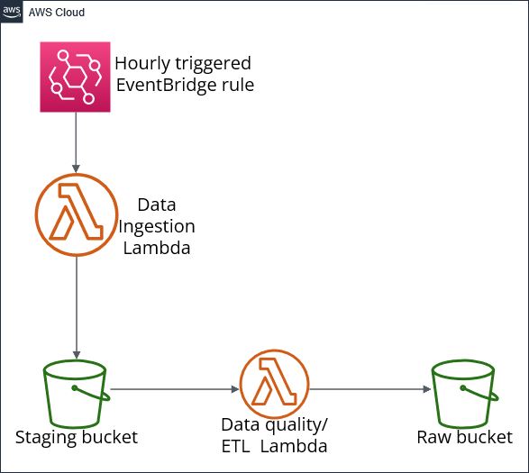

# AWS CDK Data Pipeline Deployment and Documentation


## Introduction

This repository contains the solution for the API ingestion challenge. The challenge required ingesting data from an API into AWS on a cadence aligned with the frequency of changes in the data. Below is a summary of the solution:

1. **Version Control**:
   - The codebase is versioned using Git.

2. **Infrastructure-as-Code (IaC)**:
   - AWS CDK v2 is used to define all AWS resources.

3. **Lambda for Data Ingestion**:
   - AWS Lambda functions are utilized for ingesting data
   - Data ingestion Lambda is triggered by AWS EventBridge rule on an hourly basis.

4. **Data Storage**:
   - Data is ingested into a staging s3 bucket.
   - Separate buckets are used for staging layer (raw json data) and raw layer (hive partition format csv data)

5. **ETL Step**:
   - Data is transformed and moved to a partitioned raw layer.

6. **Programming Language**:
   - Python is used for implementing both Lambda functions and CDK stack.


### Prerequisites

- AWS CLI configured with appropriate permissions.
- Python installed.
- CDK installed
- Any additional packages for Lambda functino will either need to be addded as a layer or included within the Lambda folder.

## Setup Instructions

Most of the steps have been already performed. To replicate the deployment,
- Activate virtual environment within `cdk` folder.
- Configure profile/credentials within AWS CLI.
- Run cdk bootstrap and deploy commands.
- Use `Step 5` command to rebuild lambda zip files on code change.
- Manually subscribe to SNS topic after deployment to receive notifications.

Follow these steps to deploy the AWS CDK data pipeline:

1. **Create CDK Directory**:  
    ```bash
    mkdir cdk
    cd cdk
    ```

2. **Initialize CDK App**:  
    Initialize a new CDK app using Python as the language:
    ```bash
    cdk init app --language python
    ```

3. **Set up Virtual Environment**:  
    Create and activate a virtual environment to isolate dependencies:
    ```bash
    python -m venv .venv
    .\.venv\Scripts\activate  # For Windows
    ```

4. **Update pip and Install Dependencies**:  
    Ensure pip is up-to-date and install project dependencies:
    ```bash
    python -m pip install --upgrade pip
    pip install -r requirements.txt
    ```

5. **Zip Lambda Functions**:  
    Navigate to the Lambda function directories and zip their contents:
    ```bash
    cd ../src/lambda_ingestion_api
    zip -r ../../cdk/lambda_ingestion_api.zip *
    
    cd ../lambda_dq
    zip -r ../../cdk/lambda_dq.zip *
    ```
6. **Navigate to CDK Directory**:  
    ```bash
    cd ../../cdk
    ```

7. **Copy CDK Stack file**:  
    Copy the CDK stack Python file to the CDK directory:
    ```bash
    copy ../src/cdk_stack.py cdk/.
    ```


8. **Bootstrap AWS Environment**:  
    Bootstrap the AWS environment to prepare for CDK deployment:
    ```bash
    cdk bootstrap
    ```

9. **Deploy CDK Stack**:  
    Deploy the CDK stack to AWS:
    ```bash
    cdk deploy
    ```
## Architecture


## CDK Stack Definition

`cdk_stack.py` script defines an AWS CDK stack that automates the setup of infrastructure for data ingestion and quality checks. Below is a summary of the key components:

### S3 Buckets:
- **DataFoundryStagingLayer**: Used for staging data.
- **DataFoundryRawLayer**: Used for storing raw data.

### SNS Topic:
- **DataIngestionTopic**: Provides notifications for data ingestion processes.

### Lambda Functions:
1. **Data Ingestion Lambda**:
   - Triggered by an EventBridge rule.
   - Writes data to the staging bucket.
   - Publishes notifications to the SNS topic.

2. **Data Quality Lambda**:
   - Performs data quality checks and partitioning.
   - Triggered when new files are added to staging bucket.
   - Reads from the staging bucket.
   - Writes processed data to the raw bucket.
   - Publishes notifications to the SNS topic.

### Permissions:
- Lambda functions are granted permissions to read from/write to S3 buckets and publish to the SNS topic.

### EventBridge Rule:
- **DataIngestionRule**: Triggers the data ingestion Lambda at regular intervals (every 1 hour).

### S3 Event Notification:
- Configured on the staging bucket to trigger the data quality Lambda when new files are uploaded.

## Data Ingestion Lambda Function Documentation

### Dependencies:
- `requests`: Library for making HTTP requests.

### Functionality:
- Fetches data from an API endpoint and ingests it into an Amazon S3 bucket.
- Currently fetches hourly forecast data from weather.gov for New York City. (https://api.weather.gov/gridpoints/OKX/36,36/forecast/hourly)
- Handles errors during data fetching or ingestion and publishes notifications to an SNS topic.

## Data Quality Lambda Function Documentation

### Dependencies:
- `pandas` : Libraries for data manipulation.

### Functionality:
- Performs data quality checks and partitioning on ingested data before storing it into an Amazon S3 bucket.
- Currently only checks for empty data, but more checks can be added based on requirement.
- Performs simple data manipulation, such as, renaming columns and adding new column for temperature in Celsius
- Handles errors during data processing or writing and publishes notifications to an SNS topic.
